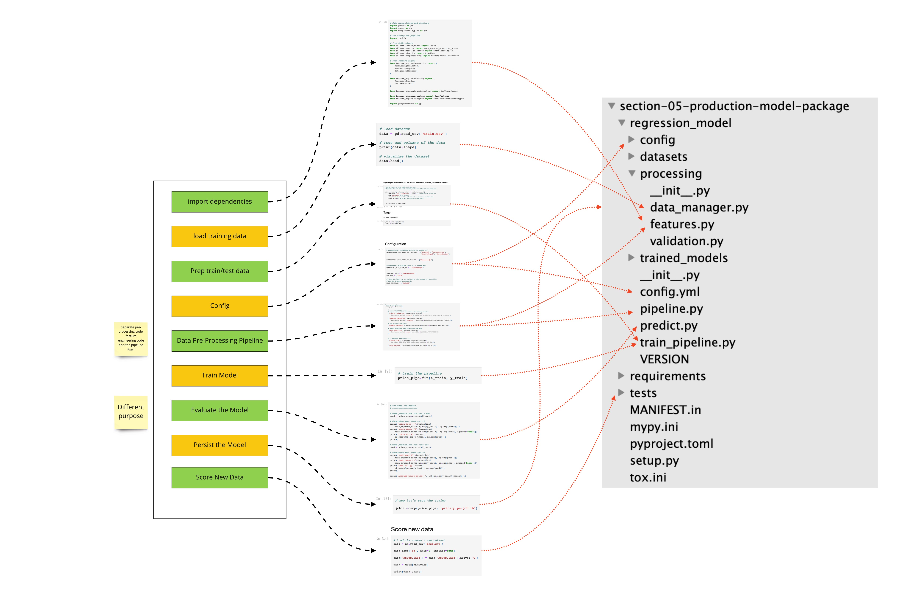

# Deployment of Machine Learning Models
Accompanying repo for the online course Deployment of Machine Learning Models.

For the documentation, visit the [course on Udemy](https://www.udemy.com/deployment-of-machine-learning-models/?couponCode=TIDREPO).

### Handy schema for converting a project from Notebook to Packages:

